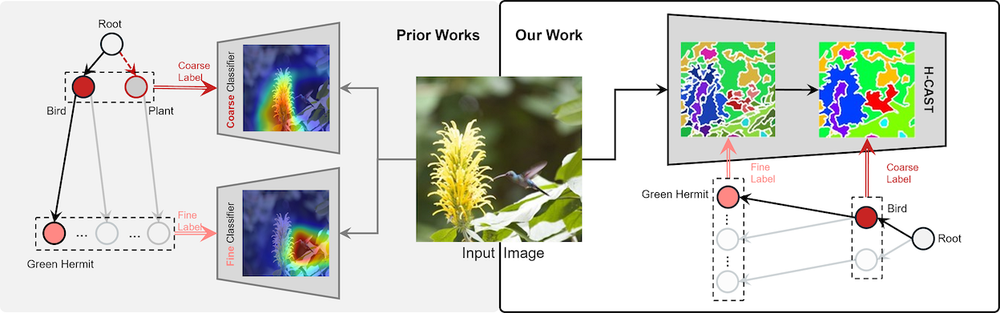

# Visually Consistent Hierarchical Image Classification (H-CAST)
By [Seulki Park](https://sites.google.com/view/seulkipark/home), [Youren Zhang](https://www.linkedin.com/in/youren-zhang-92a447251/), [Stella X. Yu](https://web.eecs.umich.edu/~stellayu/), [Sara Beery](https://beerys.github.io/), and [Jonathan Huang](http://www.jonathan-huang.org)   
Official implementation of ["Visually Consistent Hierarchical Image Classification"](https://openreview.net/forum?id=7HEMpBTb3R), ICLR 2025.

## 🔍 Overview
Our method ensures that all levels of hierarchical classification, from fine-grained species recognition to broader category distinctions, are **grounded in consistent visual cues** through segmentation. This shared visual foundation improves prediction consistency across the taxonomy, enhancing accuracy at all levels.   



## 🔗 Results and Checkpoints

| Dataset      | FPA | Model Checkpoint | 
|--------------|-------------------------------|------------------| 
| iNat21-Mini | 65.00%               | [Download](https://drive.google.com/file/d/1LuppLHSL9g-BdBkM5yh6wMEX48iF2FX5/view?usp=share_link) |  
| Entity-30    | 84.86%                       | [Download](https://drive.google.com/file/d/1R0I7KCtnRFqIaBkaY_SFqbKVx0DrbSeV/view?usp=share_link) |  
| Entity-13 | 85.61%      | [Download](https://drive.google.com/file/d/16gunLvLkHuVIXtvJtSU2JlfJTHSbCn_-/view?usp=sharing) |  
| Non-Living-26 | 82.53%      | [Download](https://drive.google.com/file/d/1UKPUSm-rkRgExYeeeRlT7YcUcRvdwQOP/view?usp=sharing) |  
| Living-17 | 85.11%      | [Download](https://drive.google.com/file/d/17ouiirBmBxD5wxOuWBi-SulVIzv8oHBL/view?usp=sharing) |  


## 🛠️ Installation
- Python: 3.10
- CUDA: 12.1
- PyTorch: 2.1.2
- DGL: 2.4.0
- GCC: 11.2.0 (Recommended to avoid errors when running DGL)

Create a conda environment with the following command:
```
# create conda env
> conda create -n hcast python=3.10
> conda activate hcast
> pip install -r requirements.txt
> pip install torch==2.1.2 torchvision==0.16.2 --index-url https://download.pytorch.org/whl/cu121


# install dgl (https://www.dgl.ai/pages/start.html)
> pip install dgl -f https://data.dgl.ai/wheels/torch-2.1/cu121/repo.html
```


## ▶️  Training
- ImageNet-pretrained [CAST](https://openreview.net/forum?id=IRcv4yFX6z)-small model can be downloaded from: [Link](https://huggingface.co/twke/CAST/blob/main/snapshots/deit/imagenet1k/cast_small/best_checkpoint.pth)

- ImageNet-pretrained [DeiT](https://arxiv.org/abs/2012.12877)-small model can be downloaded from: [Link](https://dl.fbaipublicfiles.com/deit/deit_small_patch16_224-cd65a155.pth)

```
export PYTHONPATH=deit/:$PYTHONPATH
export PYTHONPATH=deit/dataset/:$PYTHONPATH
```

###  [CUB-200-2011](https://www.vision.caltech.edu/datasets/cub_200_2011/)
- arrange_birds.py: Split the CUB dataset into separate train and test folders ('images' -> 'images_split').

#### H-CAST
```
python deit/main_suppix_hier.py \
  --model cast_small \
  --batch-size 256 \
  --epochs 100 \
  --num-superpixels 196 --num_workers 8 \
  --globalkl --gk_weight 0.5 \
  --data-set BIRD-HIER-SUPERPIXEL \
  --data-path /data/CUB_200_2011/images_split \
  --output_dir ./output/bird_hcast \
  --finetune best_checkpoint.pth      # location of ImageNet-pretrained CAST checkpoint
```

#### Hier-ViT
```
python deit/main_hier.py \
  --model deit_small_patch16_224 \
  --batch-size 256 \
  --epochs 100 \
  --num_workers 8 \
  --data-set BIRD-HIER \
  --data-path /data/CUB_200_2011/images_split \
  --output_dir ./output/bird_hvit \
  --finetune deit_small_patch16_224-cd65a155.pth # location of ImageNet-pretrained DeiT checkpoint
```

### [Aircraft](https://www.robots.ox.ac.uk/~vgg/data/fgvc-aircraft/)
#### H-CAST
```
python deit/main_suppix_hier.py \
  --model cast_small \
  --batch-size 256 \
  --epochs 100 \
  --num-superpixels 196 --num_workers 8 \
  --globalkl --gk_weight 0.5 \
  --lr 0.001 --warmup-lr 0.0001 \
  --data-set AIR-HIER-SUPERPIXEL \
  --data-path /data \
  --output_dir ./output/air_hcast \
  --finetune best_checkpoint.pth      # location of ImageNet-pretrained CAST checkpoint
```
#### Hier-ViT
```
python deit/main_hier.py \
  --model deit_small_patch16_224 \
  --batch-size 256 \
  --epochs 100 \
  --num_workers 8 \
  --data-set AIR-HIER \
  --data-path /data \
  --output_dir ./output/air_hvit \
  --finetune deit_small_patch16_224-cd65a155.pth # location of ImageNet-pretrained DeiT checkpoint
```

### [BREEDS](https://github.com/MadryLab/BREEDS-Benchmarks) (for 4 GPUs)
- We trained using a single GPU, but provide options for multi-GPU training.
- Download the [ImageNet (2012) dataset](https://www.image-net.org/download.php).
- The BREEDS train/validation files are generated in the `data` folder.
- Available `breeds_sort` options: `living17`, `nonliving26`, `entity13`, `entity30`
#### H-CAST
```
torchrun --nproc_per_node=4 deit/main_suppix_hier.py \
  --model cast_small \
  --batch-size 256 \
  --epochs 100 \
  --num-superpixels 196 --num_workers 12 \
  --data-set BREEDS-HIER-SUPERPIXEL \
  --breeds_sort entity13 \
  --data-path ILSVRC2012/imagenet \
  --output_dir ./output/entity13_hcast \
  --lr 0.001 --warmup-lr 0.0001 \
  --globalkl --gk_weight 0.5 \
  --distributed
```
#### Hier-ViT
```
torchrun --nproc_per_node=4 deit/main_hier.py \
  --model deit_small_patch16_224 \
  --batch-size 256 \
  --num_workers 12 \
  --epochs 100 \
  --data-set BREEDS-HIER \
  --breeds_sort entity13 \
  --data-path ILSVRC2012/imagenet \
  --output_dir ./output/entity13_hvit \
  --distributed
```
### [iNat21-Mini](https://github.com/visipedia/inat_comp/tree/master/2021) (for 4 GPUs)
* Use `NAT18-HIER-SUPERPIXEL` as the `data-set` argument for [iNat-2018](https://github.com/visipedia/inat_comp/tree/master/2018).
#### H-CAST
```
torchrun --nproc_per_node=4 deit/main_suppix_hier.py \
  --model cast_small \
  --batch-size 256 \
  --epochs 100 \
  --num-superpixels 196 --num_workers 12 \
  --data-set INAT21-MINI-HIER-SUPERPIXEL \
  --data-path iNat2021 \
  --output_dir ./output/inat21_mini_hcast \
  --globalkl --gk_weight 0.5 \
  --finetune best_checkpoint.pth      # location of ImageNet-pretrained CAST checkpoint
  --distributed
```
#### Hier-ViT
```
torchrun --nproc_per_node=4 deit/main_hier.py \
  --model deit_small_patch16_224 \
  --batch-size 256 \
  --epochs 100 \
  --num_workers 12 \
  --data-set INAT21-MINI-HIER \
  --data-path iNat2021 \
  --output_dir ./output/inat21_mini_hvit \
  --finetune deit_small_patch16_224-cd65a155.pth # location of ImageNet-pretrained DeiT checkpoint
  --distributed
```

---

## 📊  Evaluation

```
python deit/main_suppix_hier.py \
  --model cast_small \
  --batch-size 256 \
  --num-superpixels 196 --num_workers 8 \
  --data-set INAT21-MINI-HIER-SUPERPIXEL  \
  --data-path iNat2021 \
  --output_dir ./output/inat21_mini_hcast \
  --resume ./output/inat21_mini_hcast/best_checkpoint.pth \
  --eval 
```

## 🔗 Code Base
This repository is heavily based on **[CAST](https://github.com/twke18/CAST.git)**.  


## 📢 Citation
If you find this repository helpful, please consider citing our work:
```
@inproceedings{
    park2025visually,
    title={Visually Consistent Hierarchical Image Classification},
    author={Seulki Park and Youren Zhang and Stella X. Yu and Sara Beery and Jonathan Huang},
    booktitle={The Thirteenth International Conference on Learning Representations},
    year={2025},
    url={https://openreview.net/forum?id=7HEMpBTb3R}
}
```
Thank you for your support! 🚀
